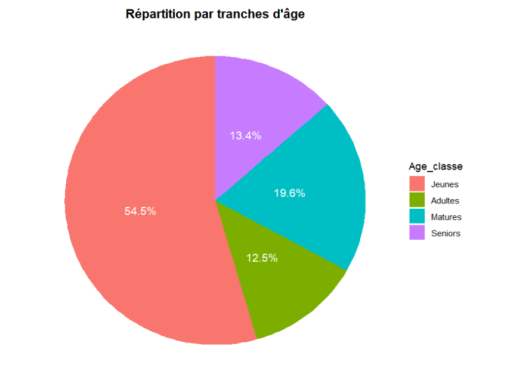
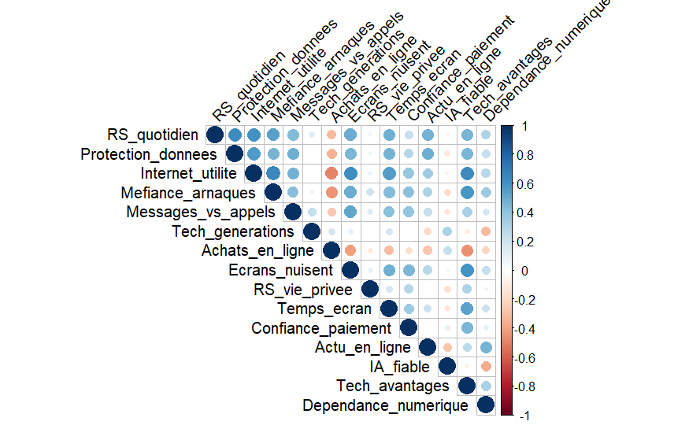
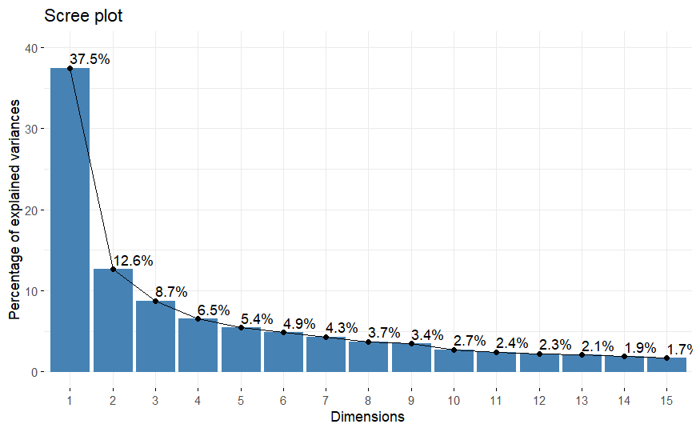
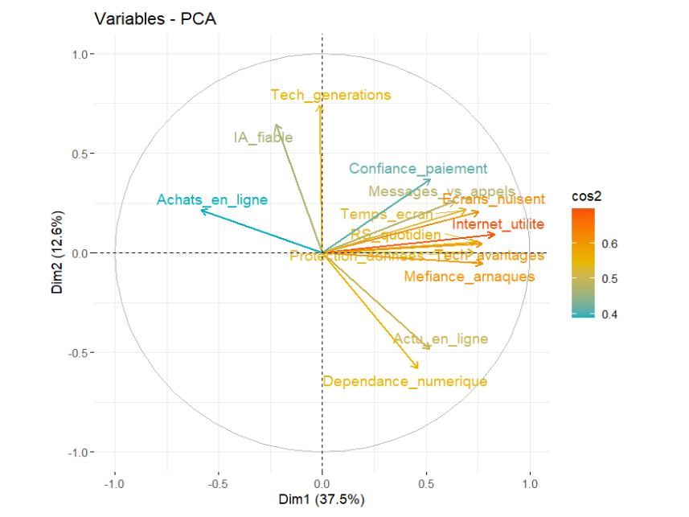
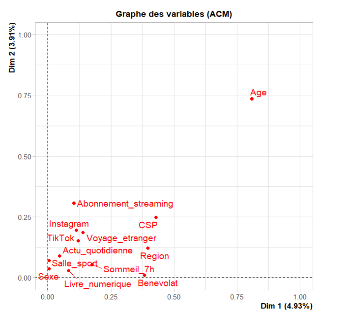
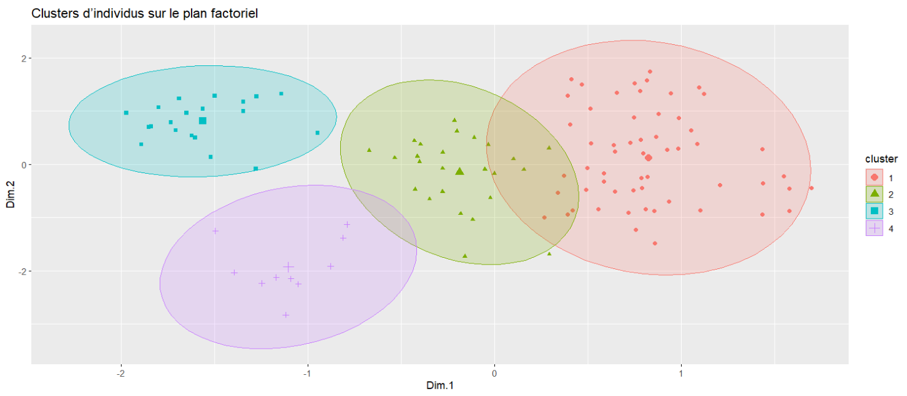

# Digital and Cultural Behavior Analysis

## Project Date

**December 2025**

## Overview

This project presents a multivariate data analysis of digital behaviors and cultural practices based on survey data collected through Google Forms. The objective is to identify the main factors structuring individual behaviors and to highlight homogeneous profiles within the studied population.

The analysis combines descriptive statistics, Principal Component Analysis, Multiple Correspondence Analysis and hierarchical clustering to better understand how individuals differ in their relationship with digital technologies, online habits and cultural practices.

## Project Context

Digital usage and cultural practices vary strongly from one individual to another. Some individuals are highly engaged with digital tools, social networks and online services, while others express more distance, caution or critical attitudes.

This project investigates the following question:

> What are the main dimensions that structure digital and cultural behaviors, and can we identify homogeneous profiles among individuals?

## Dataset

The dataset was collected using a Google Forms questionnaire.

The original Excel file was cleaned and transformed into a normalized CSV file for analysis in R.

The dataset includes variables related to:

* Age
* Gender
* Socio-professional category
* Region
* Daily social media usage
* Data protection awareness
* Perception of internet usefulness
* Online fraud awareness
* Screen time
* Trust in online payment
* Artificial intelligence reliability perception
* Cultural practices
* Streaming habits
* Travel, sport, reading and volunteering habits

The normalized dataset is stored in:

```text
data/formulaire_normalized.csv
```

## Methodology

The project follows a complete exploratory and multivariate analysis workflow.

### 1. Data Cleaning

The first step consisted of cleaning the raw survey data:

* Removal of the timestamp column
* Conversion of Likert-scale answers into numerical values
* Renaming of columns for better readability
* Export of the cleaned dataset into CSV format

### 2. Descriptive Statistics

Descriptive statistics were used to understand the sample structure.

Variables analyzed include:

* Gender
* Region
* Socio-professional category
* Age group

These variables help interpret potential differences in digital and cultural behavior.

### 3. Principal Component Analysis

A PCA was performed on the numerical block related to digital behavior.

The selected digital block contains **15 variables** and **112 observations**.

The first two dimensions were retained:

| Dimension | Explained Variance |
| --------- | -----------------: |
| Dim 1     |              37.5% |
| Dim 2     |              12.6% |

The first two axes explain approximately **50%** of the total variance.

### PCA Interpretation

**Axis 1 — Digital usage and integration**

The first dimension is mainly associated with variables such as:

* Daily social media usage
* Internet usefulness
* Screen time
* Digital dependency
* Perceived technological benefits
* Data protection awareness

This axis represents the intensity of digital usage and the level of integration of digital tools into daily life.

**Axis 2 — Trust and critical perception of technology**

The second dimension is mainly associated with:

* Perceived reliability of AI
* Trust in online payment
* Generational perception of technology
* Digital dependency
* Online news consumption

This axis reflects a more critical or confident relationship with digital technologies.

### 4. Multiple Correspondence Analysis

An MCA was performed on qualitative variables to analyze individual preferences and categorical behaviors.

The qualitative variables include:

* Gender
* Socio-professional category
* Region
* Instagram usage
* TikTok usage
* Streaming subscription
* Travel abroad
* Sport habits
* Digital reading
* Volunteering
* Daily news consumption
* Sleep habits

The MCA helped identify how categorical modalities contribute to the differentiation of profiles.

### 5. Hierarchical Clustering

A hierarchical clustering method was applied using Ward’s method on the factorial coordinates.

The dendrogram suggested a classification into **4 clusters**.

## Results

The clustering analysis identified four behavioral profiles.

| Cluster   | Profile                               |
| --------- | ------------------------------------- |
| Cluster 1 | Intensive and confident digital users |
| Cluster 2 | Intermediate and polyvalent profiles  |
| Cluster 3 | Selective and pragmatic users         |
| Cluster 4 | Distant or critical digital profiles  |

### Cluster Interpretation

**Cluster 1 — Intensive and confident digital users**
Individuals highly engaged in digital usage, with a generally positive and confident perception of technology.

**Cluster 2 — Intermediate and polyvalent profiles**
Individuals with moderate digital practices, combining regular usage with nuanced attitudes.

**Cluster 3 — Selective and pragmatic users**
Individuals who use digital tools in a targeted way, without excessive adhesion or strong rejection.

**Cluster 4 — Distant or critical digital profiles**
Individuals with more limited digital usage and a more reserved or critical attitude toward technology.

## Visual Results

### Descriptive Statistics



### Correlation Matrix



### PCA Scree Plot



### PCA Variables Map



### MCA Variables Map



### Clustering Results



## Project Structure

```text
digital-cultural-behavior-analysis/
│
├── README.md
├── requirements.txt
├── .gitignore
│
├── data/
│   ├── formulaire_raw.xlsx
│   └── formulaire_normalized.csv
│
├── notebooks/
│   └── digital_cultural_behavior_analysis.Rmd
│
├── reports/
│   └── digital_cultural_behavior_report.pdf
│
└── images/
    ├── descriptive_statistics.png
    ├── correlation_matrix.png
    ├── pca_scree_plot.png
    ├── pca_variables_map.png
    ├── mca_variables_map.png
    └── clustering_results.png
```

## How to Run

### 1. Clone the repository

```bash
git clone https://github.com/arefbakali/digital-cultural-behavior-analysis.git
cd digital-cultural-behavior-analysis
```

### 2. Open the R Markdown notebook

Open the following file in RStudio:

```text
notebooks/digital_cultural_behavior_analysis.Rmd
```

### 3. Install required R packages

In RStudio, run:

```r
install.packages(c(
  "readxl",
  "ggplot2",
  "dplyr",
  "corrplot",
  "FactoMineR",
  "factoextra"
))
```

### 4. Run the analysis

Run the R Markdown notebook section by section, or knit it to generate a report.

## Requirements

Main tools and libraries used:

* R
* RStudio
* readxl
* ggplot2
* dplyr
* corrplot
* FactoMineR
* factoextra

## Key Takeaways

* Digital and cultural behaviors can be structured through multivariate analysis.
* PCA revealed two main dimensions: digital usage intensity and trust or critical perception toward technology.
* MCA helped analyze categorical preferences and sociodemographic differences.
* Hierarchical clustering identified four distinct behavioral profiles.
* The combination of PCA, MCA and clustering provides a clear and interpretable segmentation of individuals.

## Limitations

* The sample size is limited.
* The data comes from a survey and may contain response bias.
* Some variables are self-reported and subjective.
* The clustering results depend on the selected variables and retained factorial axes.

## Future Improvements

* Collect more responses to improve representativeness
* Add statistical tests between clusters
* Build a dashboard for interactive exploration
* Compare clustering results with KMeans
* Add cluster profiling tables
* Improve the questionnaire with more behavioral indicators

## Contact

- **GitHub:** https://github.com/arefbakali
- **LinkedIn:** https://www.linkedin.com/in/aref-bak-ali/
- **Email:** aref.bak-ali@dauphine.eu
- **Portfolio:** https://portfolio-aref.vercel.app/

## Author

**Aref Bak Ali**  
AI, Data Science & Agentic AI Student  
Université Paris Dauphine-PSL

